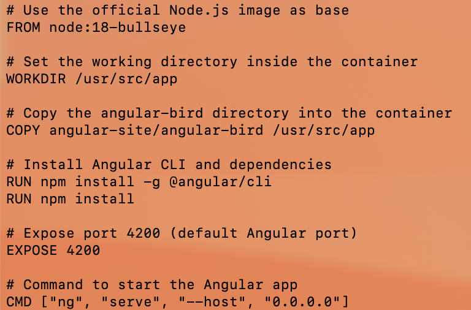

# Docker Setup

## 1. How to Install Docker for Your OS

### For macOS: 
1. **Download Docker Desktop**:
   - Visit the [Docker Desktop download page](https://www.docker.com/products/docker-desktop) and download the version for macOS.
   
2. **Install Docker**:
   - Open the downloaded `.dmg` file and drag the Docker icon to your Applications folder.
   
3. **Start Docker**:
   - Open Docker from your Applications folder or using Spotlight search. The Docker icon should appear in your menu bar once it’s running.
   
4. **Verify Installation**:
   - Open the terminal and run:
     ```bash
     docker --version
     ```
     🥳*You should see the Docker version installed.*🥳

### For Windows:
1. **Install WSL2 (Windows Subsystem for Linux)**:
   Docker Desktop requires WSL2 to run on Windows. Follow the instructions on the [official Microsoft page](https://docs.microsoft.com/en-us/windows/wsl/install) to install WSL2.
   
2. **Download Docker Desktop**:
   - Visit the [Docker Desktop download page](https://www.docker.com/products/docker-desktop) and download the Windows version.

3. **Install Docker**:
   - Run the installer and follow the on-screen instructions.
   - Docker Desktop will configure WSL2 for you during the installation.

4. **Start Docker**:
   - Once installed, open Docker from the Start menu. It will run in the background.

5. **Verify Installation**:
   - Open PowerShell or Command Prompt and run:
     ```bash
     docker --version
     ```
     You should see the Docker version installed.

### For Linux (Ubuntu/Debian-based distros):
1. **Install Docker**:
   - Run the following commands to install Docker:
     ```bash
     sudo apt-get update
     sudo apt-get install apt-transport-https ca-certificates curl software-properties-common
     curl -fsSL https://download.docker.com/linux/ubuntu/gpg | sudo apt-key add -
     sudo add-apt-repository "deb [arch=amd64] https://download.docker.com/linux/ubuntu $(lsb_release -cs) stable"
     sudo apt-get update
     sudo apt-get install docker-ce
     ```

2. **Start Docker**:
   - Enable and start Docker with:
     ```bash
     sudo systemctl enable docker
     sudo systemctl start docker
     ```

3. **Verify Installation**:
   - Check the Docker version by running:
     ```bash
     docker --version
     ```

## 2. Additional Dependencies Based on Your OS

### For Windows:
- **WSL2 (Windows Subsystem for Linux)**:
  - If you're using Docker on Windows, WSL2 is required. This allows Docker to run Linux containers on Windows.
  - Follow the WSL2 installation instructions [here](https://docs.microsoft.com/en-us/windows/wsl/install) if you haven't already set it up.

### For macOS:
- macOS does not require additional dependencies beyond Docker Desktop, as it uses native virtualization to run Docker containers.

### For Linux:
- Most Linux distributions don’t require additional dependencies beyond Docker itself, but ensure your user is added to the Docker group to run Docker commands without `sudo`:
  ```bash
  sudo usermod -aG docker $USER
   ```

## 3. How to Confirm Docker is Installed and Your System Can Successfully Run Containers

Once Docker is installed, you can confirm that Docker is working correctly by running the following commands:

### Check Docker Version:
Open a terminal and run:
 ```bash
 docker --version
 ```
 This will return the version of Docker installed, confirming it is set up.

### Run a Test Docker Container:
To verify Docker is working and can run containers, run the following command:
 ```bash
  docker run hello-world
   ```
   This will pull a test image (`hello-world`) from DockerHub and run it. If everything is set up correctly, you’ll see a success message indicating that Docker is installed and running properly.

### Check Running Containers:
You can also check for running containers using:
```bash
 docker ps
 ```
This will list all the currently running containers. If you see your `hello-world` container, that means Docker is working fine.

---


## Manually Setting Up a Container

### How to Run a Container to Test the Angular Application

To run the Docker container with your Angular application, you can use the following command:

```
docker run -p 4200:4200 jakecuso/mancuso-ceg3120
```
*note dockersuername/dockerhubrepo*
### Explanation of Flags / Arguments Used

- `-p 4200:4200`: This flag maps the container's port `4200` (which is the default port for Angular applications) to your local machine's port `4200`. This means that the Angular app running inside the container will be accessible through your browser at `http://localhost:4200`.
- `jakecuso/mancuso-ceg3120`: This is the name of the Docker image I built and pushed to DockerHub. Replace `jakecuso/mancuso-ceg3120` with the name of your Docker image if it's different.

### Commands Needed Internal to the Container to Get Additional Dependencies

Once the container is running, if any additional dependencies are needed inside the container, you can access the container and install them. 

To do this, follow these steps:

1. **Access the running container**:
   - Find the container ID by running:
     ```
     docker ps
     ```
   - Once you have the container ID, you can access it using the following command:
     ```
     docker exec -it <container_id> bash
     ```
     Replace `<container_id>` with the actual ID of your running container.

2. **Install Dependencies**:
   If additional dependencies are needed inside the container (such as npm packages), you can run:
   ```
   npm install
   ```

### Commands Needed Internal to the Container to Run the Application

To start the Angular application inside the container, run the following command inside the container (if it hasn't already been started):

```
ng serve --host 0.0.0.0
```

- `--host 0.0.0.0`: This option tells Angular to listen on all available network interfaces, making the application accessible outside the container (e.g., from your browser on `localhost:4200`).

### How to Verify That the Container is Successfully Serving the Angular Application

#### **Validate from Container Side:**
1. Once inside the container, you can check if the Angular application is running correctly by inspecting the logs. If Angular is running, you should see output similar to:
   ```
   ** Angular Live Development Server is listening on 0.0.0.0:4200, open your browser on http://localhost:4200/ **
   ```
   
2. You can also check if the application is running on port `4200` inside the container using:
   ```
   netstat -tuln | grep 4200
   ```

#### **Validate from Host Side:**
1. On your local machine (host), open a web browser and navigate to:
   ```
   http://localhost:4200
   ```
   If the Angular app is running correctly, you should see the application’s front-end in your browser.

2. You can also use `curl` or `wget` to verify the container is serving the app:
   ```
   curl http://localhost:4200
   ```
   If the application is running, you should receive the HTML content of the Angular app.
mine looked like this 


---
## Dockerfile & Building Images



### Summary / Explanation of Instructions Written in the Dockerfile

Here’s a breakdown of the key instructions in your `Dockerfile`:

1. ```
    FROM node:18-bullseye
    ```
   - This sets the base image to `node:18-bullseye`, which provides the necessary environment to run a Node.js-based application (Angular requires Node.js to run).
   
2. ```
    WORKDIR /usr/src/app
    ```

   - This sets the working directory inside the container to `/usr/src/app`. Any subsequent commands will be run in this directory.

3. ```
    COPY angular-site/angular-bird /usr/src/app
    ```
   - This copies the contents of the `angular-site/angular-bird` directory from your local machine into the `/usr/src/app` directory inside the container.

4. ```
    RUN npm install -g @angular/cli
    ```
   - This installs the Angular CLI globally inside the container so that we can use Angular commands like `ng serve` to run the application.

5. ```
    RUN npm install
    ```
   - This installs the application’s dependencies (listed in the `package.json` file) inside the container.

6. ```
    EXPOSE 4200
    ```
     
   - This tells Docker that the container will use port `4200` for the Angular application. This is mainly for documentation purposes, as you’ll map the container port to the host machine port when running the container.

7. ```
    CMD ["ng", "serve", "--host", "0.0.0.0"]
    ```
   - This runs the Angular application when the container starts. It tells Angular to bind to all network interfaces (`0.0.0.0`), so it will be accessible from your browser on `localhost:4200`.

---

### How to Build an Image from the Repository Dockerfile

To build the Docker image from the `Dockerfile`, I ran the following command in my terminal:

```
docker build -t jakecuso/mancuso-ceg3120 .
```

Explanation:
- `docker build`: Tells Docker to build an image from the current directory (which contains the `Dockerfile`).
- `-t jakecuso/mancuso-ceg3120`: Tags the image with a name (`jakecuso/mancuso-ceg3120`). Replace this with your preferred image name if different.
- `.`: Refers to the current directory as the context for the build.

Once the build completes, you’ll see a confirmation message like mine:
```
Successfully built <image-id>
Successfully tagged jakecuso/mancuso-ceg3120:latest
```

---

### How to Run a Container That Will Serve the Angular Application from the Image Built by the Dockerfile

To run the Angular application inside the container, use the following command:

```
docker run -p 4200:4200 jakecuso/mancuso-ceg3120
```

Explanation:
- `-p 4200:4200`: This maps port `4200` on your host machine to port `4200` inside the container, allowing you to access the Angular app at `http://localhost:4200`.
- `jakecuso/mancuso-ceg3120`: The name of the Docker image you built.

---

### How to Verify That the Container is Successfully Serving the Angular Application

#### **Validate from Container Side:**
1. After starting the container, check the logs to ensure Angular is running. You should see output similar to:
   ```
   ** Angular Live Development Server is listening on 0.0.0.0:4200, open your browser on http://localhost:4200/ **
   ```

2. You can also verify that the Angular app is running on port `4200` inside the container using:
   ```
   netstat -tuln | grep 4200
   ```

#### **Validate from Host Side:**
1. On your local machine (host), open a web browser and navigate to:
   ```
   http://localhost:4200
   ```
   If the Angular app is running correctly, you should see the front-end of the application in your browser.

2. You can also use `curl` or `wget` to verify the container is serving the app:
   ```
   curl http://localhost:4200
   ```
   If the application is running, you should receive the HTML content of the Angular app.

---

## Working with Your DockerHub Repository

### How to Create a Public Repo in DockerHub

1. **Log in to DockerHub**:
   - Go to [DockerHub](https://hub.docker.com/) and log in with your DockerHub account credentials.

2. **Create a New Repository**:
   - In the top-right corner, click on your profile icon and select **Repositories**.
   - Click the **Create Repository** button.
   - Fill in the repository details:
     - **Repository name**: Choose a name, I used as `mancuso-CEG3120`.
     - **Description**: Add a brief description of the project, such as "Docker repository for Angular app".
     - **Visibility**: Select **Public** to make your repository publicly accessible.
   - Click **Create** to create your DockerHub repository.

---

### How to Create a Personal Access Token (PAT) for Authentication

1. **Go to Your DockerHub Account Settings**:
   - In DockerHub, click on your profile icon and select **Account Settings**.

2. **Generate a PAT**:
   - Navigate to the **Security** tab.
   - Under **Access Tokens**, click **Create Token**.
   - Provide a **name** for the token (e.g., `CI/CD Auth`).
   - Set an **expiration date** if necessary.
   - **Copy the token** once it's created. **This is the only time you will see the token**.


---

### How to Authenticate with DockerHub via CLI Using DockerHub Credentials

1. **Log in to DockerHub** via the CLI:
   - In your terminal, run:
     ```
     docker login
     ```
   - Enter your **DockerHub username** and **Personal Access Token (PAT)** when prompted. Use your PAT as the password.

---

### How to Push Container Image to Your DockerHub Repository

Once you have authenticated with DockerHub via the CLI, you can push your Docker image to your public repository. Here's how:

1. **Tag the Image**:
   - If you haven't already tagged your image with the correct name, do so with the following command:
     ```
     docker tag <your-image> jakecuso/mancuso-ceg3120
     ```
   - Replace `<your-image>` with the name of the image you built (e.g., `angular-bird-app`).

2. **Push the Image**:
   - Now, push the image to your DockerHub repository with this command:
     ```
     docker push jakecuso/mancuso-ceg3120
     ```
   - Replace `jakecuso/mancuso-ceg3120` with your actual DockerHub username and repository name 

---

### Link to my DockerHub Repository 


https://hub.docker.com/r/jakecuso/mancuso-ceg3120

This link will give anyone access to My Docker image, and they can pull and run it by using the `docker pull` command.
