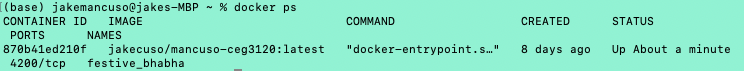
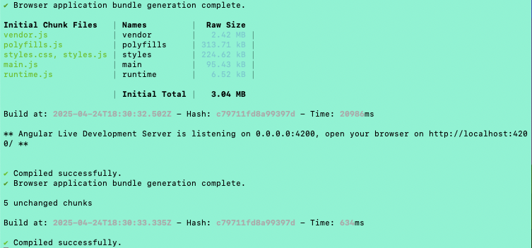
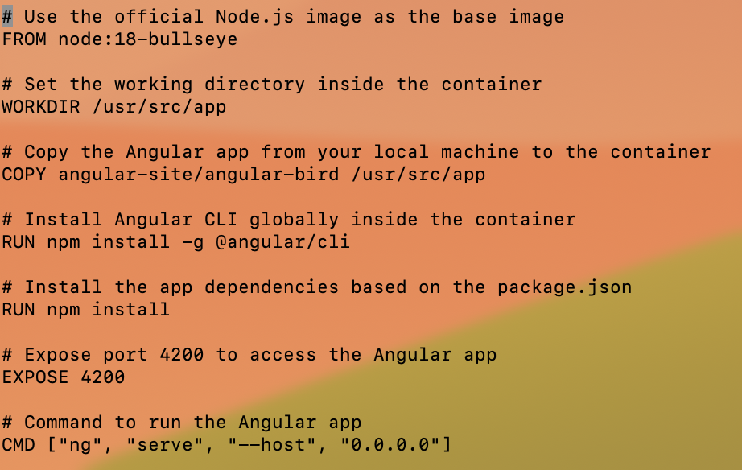
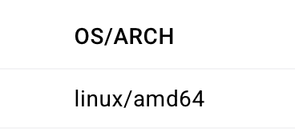
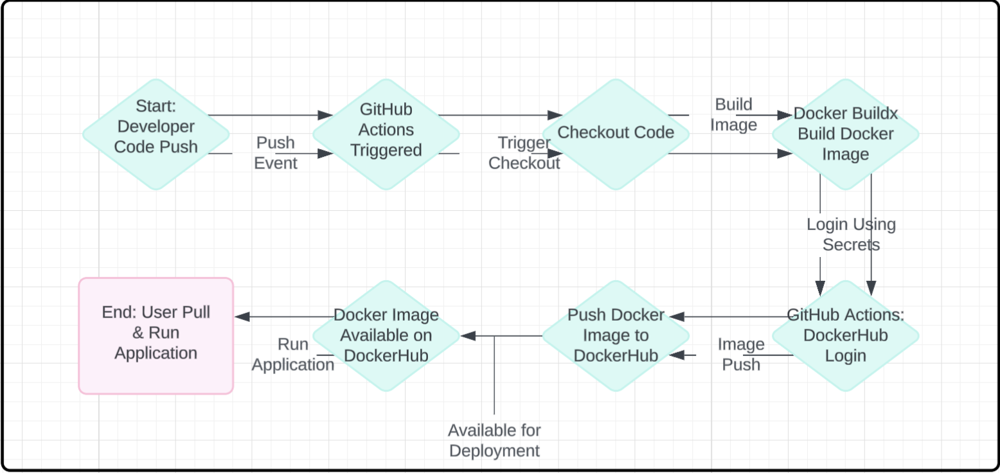

# Docker Setup

## 1. How to Install Docker for Your OS

### For macOS: (my OS)
1. **Download Docker Desktop**:
   - Visit the [Docker Desktop download page](https://www.docker.com/products/docker-desktop) and download the version for macOS.
   
2. **Install Docker**:
   - Open the downloaded `.dmg` file and drag the Docker icon to your Applications folder.
   
3. **Start Docker**:
   - Open Docker from your Applications folder or using Spotlight search. The Docker icon should appear in your menu bar once it’s running.
   
4. **Verify Installation**:
   - Open the terminal and run:
     ```bash
     docker --version
     ```
     🥳*You should see the Docker version installed.*🥳


## 2. How I Confirmed That Docker Was Installed & Make Sure My System Can Successfully Run Containers

Once Docker Was installed, I can confirm that Docker is working correctly by running the following commands:

### Check Docker Version:
Open a terminal and run:
 ```bash
 docker --version
 ```
 This will return the version of Docker  I installed, confirming it is set up.

### Run a Test Docker Container:
To verify Docker is working and can run containers, I can run the following command:
 ```bash
  docker run hello-world
   ```
   This will pull a test image (`hello-world`) from DockerHub and run it. If everything is set up correctly, I will see a success message indicating that Docker is installed and running properly.

### Check Running Containers:
We can also check for running containers using:
```bash
 docker ps
 ```
This will list all the currently running containers. If the `hello-world` container that I made shows up, that means Docker is working fine.

---


## Manually Setting Up a Container

### How to Run a Container to Test the Angular Application

To run the Docker container with My Angular application, I will use the following command:

```
docker run -p 4200:4200 jakecuso/mancuso-ceg3120
```

### Explanation of Flags / Arguments Used

- `-p 4200:4200`: This flag maps the container's port `4200` (which is the default port for Angular applications) to my local machine's port `4200`. This means that the Angular app running inside the container will be accessible through my browser at `http://localhost:4200`.
- `jakecuso/mancuso-ceg3120`: This is the name of my Docker image I built and pushed to DockerHub. 
- Replace `jakecuso/mancuso-ceg3120` with the name of your Docker image if you are following along.

### Commands Needed Internal to the Container to Get Additional Dependencies

Once the container is running, if any additional dependencies are needed inside the container, I can access the container and install them. 

To do this, I did these steps:

1. **Access the running container**:
   - Found the container ID by running:
     ```
     docker ps
     ```
     

      *the container ID in my case is `870b41ed210f`*

   
   - Once I had the container ID, I can access it using the following command:
     ```
     docker exec -it 870b41ed210f bash
     ```
     Replace `<container_id>` with the actual ID of your running container.

2. **Install Dependencies**:
   If additional dependencies are needed inside the container (such as npm packages), you can run:
   ```
   npm install
   ```

### Commands Needed Internal to the Container to Run the Application

To start the Angular application inside the container, I need to run the following command inside the container (if it hasn't already been started):

```
ng serve --host 0.0.0.0
```

- `--host 0.0.0.0`: This option tells Angular to listen on all available network interfaces, making the application accessible outside the container (e.g., from my browser on `localhost:4200`).

### How to Verify That the Container is Successfully Serving the Angular Application

#### **Validate from Container Side:**
1. Once inside the container, you can check if the Angular application is running correctly by inspecting the logs. If Angular is running, you should see output similar to:
   ```
   ** Angular Live Development Server is listening on 0.0.0.0:4200, open your browser on http://localhost:4200/ **
   ```
   
2. I can also check if the application is running on port `4200` inside the container using:
   ```
   netstat -tuln | grep 4200
   ```

#### **Validate from Host Side:**
1. On my local machine (host), I can open a web browser and navigate to:
   ```
   http://localhost:4200
   ```
   If the Angular app is running correctly, I should see the application’s front-end in my browser.

2. I can also use `curl` or `wget` to verify the container is serving the app:
   ```
   curl http://localhost:4200
   ```

   
   If the application is running, you should receive the HTML content of the Angular app.
Mine looked like this



---
## Dockerfile & Building Images



### Summary / Explanation of Instructions Written in the Dockerfile

Here’s a breakdown of the key instructions in my `Dockerfile`:

1. ```dockerfile
   FROM node:18-bullseye
   ```
   - This sets the base image to `node:18-bullseye`, which provides the necessary environment to run a Node.js-based application (Angular requires Node.js to run).
   
2. ```dockerfile
   WORKDIR /usr/src/app
   ```
   - This sets the working directory inside the container to `/usr/src/app`. Any subsequent commands will be run in this directory.

3. ```dockerfile
   COPY angular-site/angular-bird /usr/src/app
   ```
   - This copies the contents of the `angular-site/angular-bird` directory from my local machine into the `/usr/src/app` directory inside the container.

4. ```dockerfile
   RUN npm install -g @angular/cli
   ```
   - This installs the Angular CLI globally inside the container so that we can use Angular commands like `ng serve` to run the application.

5. ```dockerfile
   RUN npm install
   ```
   - This installs the application’s dependencies (listed in the `package.json` file) inside the container.

6. ```dockerfile
   EXPOSE 4200
   ```
   - This tells Docker that the container will use port `4200` for the Angular application. This is mainly for documentation purposes, as I will map the container port to the host machine port when running the container.

7. ```dockerfile
   CMD ["ng", "serve", "--host", "0.0.0.0"]
   ```
   - This runs the Angular application when the container starts. It tells Angular to bind to all network interfaces (`0.0.0.0`), so it will be accessible from my browser on `localhost:4200`.
   
---------

### How to Build an Image from the Repository Dockerfile

To build the Docker image from the `Dockerfile`, I ran the following command in my terminal:

```
docker build -t jakecuso/mancuso-ceg3120 .
```

Explanation:
- `docker build`: Tells Docker to build an image from the current directory (which contains the `Dockerfile`).
- `-t jakecuso/mancuso-ceg3120`: Tags the image with a name (`jakecuso/mancuso-ceg3120`). Replace this with your preferred image name if different.
- `.`: Refers to the current directory as the context for the build.

Once the build completes, you’ll see a confirmation message like mine:
```
Successfully built <image-id>
Successfully tagged jakecuso/mancuso-ceg3120:latest
```

---

### How to Run a Container That Will Serve the Angular Application from the Image Built by the Dockerfile

To run the Angular application inside the container, use the following command:

```
docker run -p 4200:4200 jakecuso/mancuso-ceg3120
```

Explanation:
- `-p 4200:4200`: This maps port `4200` on your host machine to port `4200` inside the container, allowing you to access the Angular app at `http://localhost:4200`.
- `jakecuso/mancuso-ceg3120`: The name of the Docker image you built.

---

### How to Verify That the Container is Successfully Serving the Angular Application

#### **Validate from Container Side:**
1. After starting the container, check the logs to ensure Angular is running. You should see output similar to:
   ```
   ** Angular Live Development Server is listening on 0.0.0.0:4200, open your browser on http://localhost:4200/ **
   ```

2. You can also verify that the Angular app is running on port `4200` inside the container using:
   ```
   netstat -tuln | grep 4200
   ```

#### **Validate from Host Side:**
1. On your local machine (host), open a web browser and navigate to:
   ```
   http://localhost:4200
   ```
   If the Angular app is running correctly, you should see the front-end of the application in your browser.

2. You can also use `curl` or `wget` to verify the container is serving the app:
   ```
   curl http://localhost:4200
   ```
   If the application is running, you should receive the HTML content of the Angular app.

---
## 🛠️ Manual Setup Instructions (Without Dockerfile)

To manually set up this project without using the Dockerfile, follow these steps:

```bash
# 1. Start from a clean Linux environment (e.g., Ubuntu 22.04 or Debian Bullseye)

# 2. Install Node.js version 18
curl -fsSL https://deb.nodesource.com/setup_18.x | sudo -E bash -
sudo apt-get install -y nodejs

# (Optional) Verify the installation
node -v
npm -v

# 3. Clone the repository
git clone https://github.com/your-username/your-repo-name.git
cd your-repo-name

# 4. Install dependencies
npm install

# 5. Run the application
npm start
```

*This replicates the environment used in the Dockerfile (based on `node:18`)*

---

## Working with Your DockerHub Repository

### How to Create a Public Repo in DockerHub

1. **Log in to DockerHub**:
   - Go to [DockerHub](https://hub.docker.com/) and log in with your DockerHub account credentials.

2. **Create a New Repository**:
   - In the top-right corner, click on your profile icon and select **Repositories**.
   - Click the **Create Repository** button.
   - Fill in the repository details:
     - **Repository name**: Choose a name, I used as `mancuso-CEG3120`.
     - **Description**: Add a brief description of the project, such as "Docker repository for Angular app".
     - **Visibility**: Select **Public** to make your repository publicly accessible.
   - Click **Create** to create your DockerHub repository.

---

### How to Create a Personal Access Token (PAT) for Authentication

1. **Go to Your DockerHub Account Settings**:
   - In DockerHub, click on your profile icon and select **Account Settings**.

2. **Generate a PAT**:
   - Navigate to the **Security** tab.
   - Under **Access Tokens**, click **Create Token**.
   - Provide a **name** for the token (e.g., `CI/CD Auth`).
   - Set an **expiration date** if necessary.
   - **Copy the token** once it's created. **This is the only time you will see the token**.


---

### How to Authenticate with DockerHub via CLI Using DockerHub Credentials

1. **Log in to DockerHub** via the CLI:
   - In your terminal, run:
     ```
     docker login
     ```
   - Enter your **DockerHub username** and **Personal Access Token (PAT)** when prompted. Use your PAT as the password.

---

### How to Push Container Image to Your DockerHub Repository

Once you have authenticated with DockerHub via the CLI, you can push your Docker image to your public repository. Here's how:

1. **Tag the Image**:
   - If you haven't already tagged your image with the correct name, do so with the following command:
     ```
     docker tag <your-image> jakecuso/mancuso-ceg3120
     ```
   - Replace `<your-image>` with the name of the image you built (e.g., `angular-bird-app`).

2. **Push the Image**:
   - Now, push the image to your DockerHub repository with this command:
     ```
     docker push jakecuso/mancuso-ceg3120
     ```
   - Replace `jakecuso/mancuso-ceg3120` with your actual DockerHub username and repository name 

---

### Link to my DockerHub Repository 


https://hub.docker.com/r/jakecuso/mancuso-ceg3120

This link will give anyone access to My Docker image, and they can pull and run it by using the `docker pull` command.
---
# GitHub Actions Setup and Configuration

## Configuring GitHub Repository Secrets

### How to Create a Personal Access Token (PAT) for Authentication

To allow GitHub Actions to authenticate with **DockerHub**, you need to create a **Personal Access Token (PAT)**.

1. **Log in to DockerHub**:
   - Go to [DockerHub](https://hub.docker.com/) and log in to your account.

2. **Generate a Personal Access Token**:
   - Click on your profile icon in the top right and navigate to **Account Settings**.
   - In the left sidebar, select **Security**.
   - Under the **Access Tokens** section, click **Create Token**.
   - Name the token (e.g., `CI/CD Access`), set an expiration date if necessary, and click **Create**.
   - **Copy the token** immediately as this is the only time you'll be able to view it.

---

### How to Set Repository Secrets

Once you've created your **DockerHub PAT**, you need to add it to your GitHub repository as a secret for GitHub Actions.

1. **Go to Your GitHub Repository**.
2. **Navigate to Settings**:
   - On your repository page, click on **Settings**.
   - Scroll down to **Secrets** under the **Security** section.
3. **Add Repository Secrets**:
   - Click **New repository secret**.
   - **Add the following secrets**:
     - **`DOCKER_USERNAME`**: Your DockerHub **username**.
     - **`DOCKER_TOKEN`**: The **Personal Access Token (PAT)** you generated in DockerHub.

*These secrets will be used to authenticate the GitHub Actions workflow with DockerHub.*

---

### Secrets Used for This Project

- **`DOCKER_USERNAME`**: Stores your **DockerHub username**.
- **`DOCKER_TOKEN`**: Stores your **DockerHub Personal Access Token (PAT)**, which is required for authentication during Docker image build and push.

These secrets are securely stored in GitHub and will be used by the workflow to log in to DockerHub and push the built image.

---

## CI with GitHub Actions

### Summary of What the Workflow Does

This GitHub Actions workflow automates the process of building a Docker image for the Angular application when changes are pushed to the `main` branch. It then pushes the built image to **DockerHub** so that it can be used or deployed from anywhere.

### Explanation of Workflow Steps

1. **Checkout Code**:
   - The first step uses the `actions/checkout@v2` action to check out the latest code from the GitHub repository. This ensures that the workflow builds the most up-to-date version of the application.

2. **Set up Docker Buildx**:
   - The `docker/setup-buildx-action@v2` action sets up **Docker Buildx**, which allows us to build multi-platform images (in this case, `amd64`).

3. **Cache Docker Layers**:
   - The `actions/cache@v2` action caches Docker layers to speed up the build process for subsequent builds. This helps avoid rebuilding the entire Docker image from scratch each time.

4. **Log in to DockerHub**:
   - The `docker/login-action@v2` action uses the `DOCKER_USERNAME` and `DOCKER_TOKEN` secrets to authenticate with DockerHub. This step ensures that the workflow can push the Docker image to DockerHub.

5. **Build and Push Docker Image**:
   - The `docker build` command builds the Docker image from the `Dockerfile` in the repository.
   - The `docker push` command pushes the built image to DockerHub under the `jakecuso/mancuso-ceg3120` repository.

---

### Values That Need to Be Updated

If you're using this workflow in a different repository or with a different DockerHub account, you'll need to update the following:

- **In the Workflow**:
  - The `docker build` and `docker push` commands reference the image name `jakecuso/mancuso-ceg3120`. You should update this to match your DockerHub username and repository name if it's different.
  
    For example:
    ```yaml
    docker build --platform linux/amd64 -t yourusername/yourrepository .
    docker push yourusername/yourrepository
    ```

- **In the Repository**:
  - Make sure to update the **`DOCKER_USERNAME`** and **`DOCKER_TOKEN`** secrets with your **DockerHub credentials** in GitHub **Secrets**.
  
---

### Link to the Workflow File

You can find the workflow file [here](.github/workflows/ci.yml).

This file defines the CI/CD pipeline for building and pushing the Docker image to DockerHub when changes are pushed to the `main` branch.

---

## Testing and Validating the Workflow

### How to Test That Your Workflow Did Its Tasking

1. **Push Changes**:
   - To trigger the GitHub Actions workflow, push changes to the `main` branch in your GitHub repository.
   
2. **Check the Actions Tab**:
   - Go to the **Actions** tab of your GitHub repository to see the status of the workflow.
   - If everything is set up correctly, you should see the workflow run and complete successfully.

3. **Verify Docker Image on DockerHub**:
   - Once the workflow finishes, check your **DockerHub** account to verify that the new Docker image has been pushed.
   - You should be able to see the `jakecuso/mancuso-ceg3120` image in your repository on DockerHub.

### How to Verify That the Image in DockerHub Works When a Container Is Run

1. **Pull the Docker Image**:
   - On your local machine, run the following command to pull the image from DockerHub:
   ```bash
   docker pull jakecuso/mancuso-ceg3120
   ```

2. **Run the Docker Container**:
   - After pulling the image, run it locally:
   ```bash
   docker run -p 4200:4200 jakecuso/mancuso-ceg3120
   ```

3. **Check the Angular Application**:
   - Open your browser and navigate to `http://localhost:4200`. If everything is set up correctly, you should see the Angular application running inside the Docker container.

---
## Milestone 1 Fixes and Updates

### 1. Starting with a Base Image:
- **What was fixed:**

  The Dockerfile was updated to use the official node:18-bullseye base image, which ensures compatibility with the Angular application and resolves issues from a previously custom base image. Additionally, I added a section in the README to explain how to manually set up the Angular project without using Docker. This provides an alternative setup for users who prefer to run the application locally without Docker containers.

### 2. Building for `amd64` Architecture:



- **What was fixed:**
  - The **`docker build`** command was updated to include the **`--platform linux/amd64`** flag. This ensures the image is built for the correct `amd64` architecture, which is required for compatibility across systems and aligns with project requirements.
### 6. Repo Migration:
- **What was fixed:**
  - The project was **moved/copied** into a **new repository**: [ceg3120-cicd-Jakecuso](https://github.com/WSU-kduncan/ceg3120-cicd-Jakecuso).
  - All configurations from the previous repo were preserved and successfully migrated to this new repository.
---
# Part 3 - Project Description & Diagram

## Continuous Integration Project Overview

### Goal of this Project

The goal of this project is to set up a Continuous Integration (CI) pipeline using **GitHub Actions** to automatically build and push a **Docker image** whenever changes are made to the `main` branch of the GitHub repository. This ensures that the Docker image is always up-to-date with the latest code changes, and it is automatically pushed to **DockerHub** for easy deployment.

### Tools Used in This Project and Their Roles

1. **Docker**:
   - **Role**: Docker is used to create and manage containers. In this project, it is used to package the Angular application and its dependencies into a Docker image, which can then be deployed and run in a container.
   
2. **GitHub Actions**:
   - **Role**: GitHub Actions automates the build and deployment process. It listens for changes in the `main` branch and triggers the build process (i.e., it builds the Docker image and pushes it to DockerHub).
   
3. **DockerHub**:
   - **Role**: DockerHub is used as a repository to store the Docker images built from this project. These images can be pulled and run in any environment that supports Docker.

### Diagram of the CI Process

The following diagram illustrates the **Continuous Integration (CI)** process set up in this project:



---
## **Resources**
###### For additional information, guides, and references related to Docker, GitHub Actions, Angular, and more, check out the [Resources](README-RESOURCES.md).

---