# Continuous Deployment (CD) Workflow 

This document provides the steps for **generating tags**, **viewing tags**, and **pushing tags** in my Git repository. Tags are essential for versioning and triggering your CI/CD pipelines.

---

## 1) **Generating Tags**

In Git, tags are used to mark specific points in the project’s history. They are commonly used to mark release versions.

To **generate a tag** in Git, use the following command:

```bash
git tag -a <tag_name> -m "<message>"
```
<t-ag_name->: The name of the tag, typically following semantic versioning, e.g., v1.0.0.

<-message->: A short description of the tag (similar to a commit message).

Example:
```bash
git tag -a v1.0.0 -m "First release for Project 5"
```
This will create an annotated tag with the name v1.0.0 and a message "First release for Project 5".

## 2) How to See Tags in a Git Repository?

To see all the tags in your Git repository, I'd use the following command:
```bash
git tag
```
This will list all the tags available in the current repository. For more detailed information about each tag, you can use:
```bash
git show <tag_name>
```
Example:
```bash
git show v1.0.0
```
## 3) How To Generate a Tag in a Git Repository?

To create a new tag in the repository:

Navigate to my repository on my local machine. I 
Ran the following command to create a new tag:
```bash
git tag -a v1.0.1 -m "Tag for version 1.0.1"
```
`Verify the tag was created`:
git tag
This should display `v1.0.1` as part of the list of tags.
## 4) How to Push a Tag in a Git Repository to GitHub

Once you have created a tag locally, you need to push it to GitHub to trigger the CI/CD workflow.

To push a single tag:
```bash
git push origin <tag_name>
```
Example:
```bash
git push origin v1.0.1
```
If I want to push all tags at once:
```
git push --tags
```
This will push all tags that are available in my local repository to GitHub.

---


# Semantic Versioning Container Images with GitHub Actions

This document will explain how the **GitHub Actions workflow** for **semantic versioning** of container images works. The workflow is responsible for automating the process of building, tagging, and pushing Docker images to **DockerHub** when new version tags are pushed to the repository.

---

## Summary of What a Workflow Does and When It Does It

The **workflow** is designed to build and push **Docker images** to **DockerHub** whenever a **version tag** is pushed to the GitHub repository. It uses **semantic versioning** (e.g., `v1.0.0`, `v1.1.0`) to tag the Docker images. The workflow only runs when a tag is pushed to GitHub that follows the pattern `v*.*.*`.

### Trigger:
- The workflow is triggered by **pushes to tags** matching the format `v*.*.*` (e.g., `v1.0.0`, `v2.1.0`).
- The **push** can either come from the `main` branch or from a version tag.

---

## Explanation of Workflow Steps

1. **Checkout the Code**:
   - The workflow checks out the code from the repository using the `actions/checkout@v2` action to ensure the code and Dockerfile are available to the runner.
   ```yaml
   - name: Checkout code
     uses: actions/checkout@v2
    ```
    

2. **Set Up Docker Buildx**:
   - The `docker/setup-buildx-action@v1` action is used to set up **Docker Buildx**, which provides advanced features for building Docker images, including multi-platform support.
   ```yaml
   - name: Set up Docker Buildx
     uses: docker/setup-buildx-action@v1
    ```
3. **Login to DockerHub**:
   - The workflow logs into **DockerHub** using the `docker/login-action@v1` action. It uses the **DockerHub credentials** stored in **GitHub Secrets** (`DOCKER_USERNAME` and `DOCKER_TOKEN`).
   ```yaml
   - name: Login to DockerHub
     uses: docker/login-action@v1
     with:
       username: ${{ secrets.DOCKER_USERNAME }}
       password: ${{ secrets.DOCKER_TOKEN }}
    ```
4. **Build and Push the Docker Image**:
   - The `docker/build-push-action@v2` action is used to build the Docker image from the repository's Dockerfile and push the built image to **DockerHub**. 
   - The image is tagged using **semantic versioning** based on the GitHub tag (e.g., `v1.0.0`, `v1.1.0`).
   ```yaml
   - name: Build and push Docker image
     id: docker_build
     uses: docker/build-push-action@v2
     with:
       context: ./project5  # Build the Docker image from project5 folder
       push: true  # Push the image to DockerHub
       tags: |
         ${{ secrets.DOCKER_USERNAME }}/${{ secrets.DOCKER_HUB_REPO }}:latest
         ${{ secrets.DOCKER_USERNAME }}/${{ secrets.DOCKER_HUB_REPO }}:${{ github.sha }}
         ${{ secrets.DOCKER_USERNAME }}/${{ secrets.DOCKER_HUB_REPO }}:${{ github.ref_name }}
    ```

---

## Explanation / Highlight of Values That Need Updated If Used in a Different Repository

If I was to use this workflow in a **different repository**, the following values need to be updated:

1. **DOCKER_USERNAME**:
   - The DockerHub username must be updated in **GitHub Secrets**. This username will be used for both the login and the tag naming.
   - Example: `your-docker-username`.

2. **DOCKER_HUB_REPO**:
   - The **DockerHub repository** name needs to be updated. This should be the name of the repository in DockerHub where the image will be pushed.
   - Example: `your-repository-name`.

3. **GitHub Secrets**:
   - Update **DOCKER_USERNAME**, **DOCKER_TOKEN**, and **DOCKER_HUB_REPO** in the repository's **GitHub Secrets**.
   - Make sure that the **DockerHub token** has both **read and write** permissions.

4. **Build Context**:
   - If the Dockerfile or the project folder is in a different location, change the `context` value. For example, if I want to build from `project4`, update the context to `./project4`. 
   
   *In my case I have it in both (project 4 & 5 to show my progress) but my most updated workflow is in project 5 so im using that*

---


## Link to Workflow File in my GitHub Repository


[ci-project5.yml Workflow File](https://github.com/WSU-kduncan/ceg3120-cicd-Jakecuso/tree/main/.github/workflows)


---


# Testing & Validating

This section describes how to test and validate that my GitHub Actions workflow for **building and pushing Docker images** works as expected, and how to verify that the image in **DockerHub** works when run in a container.

---

## How I Can Test That My Workflow Did Its Tasking

1. **Verify Workflow Run**:
   - Go to the **GitHub repository** and navigate to the **Actions** tab.
   - Check if the workflow ran successfully when a tag was pushed to the repository.
   - Ensure the workflow completes without errors in the logs. If there are errors, check the logs to identify what went wrong.

2. **Check DockerHub**:
   - Log in to **DockerHub**.
   - Go to the repository where the image was pushed.
   - Verify that the **Docker image** appears in the repository with the appropriate tags (e.g., `latest`, version tag like `v1.0.0`, or commit SHA).

3. **Check Build Logs**:
   - In the **GitHub Actions** tab, review the logs for the **Build and Push Docker image** step. Ensure that the build was successful and that the image was pushed to DockerHub.

---

## How to Verify That the Image in DockerHub Works When a Container Is Run Using the Image (Steps & Instrutions)

Once the Docker image has been pushed to DockerHub, it's important to verify that it works as expected by running a container.

1. **Pull the Image from DockerHub**:
   - On your local machine or in a remote environment, pull the image from DockerHub to ensure it was successfully pushed.
   Example:
   ```bash
     docker pull jakecuso/mancuso-ceg3120:v1.0.0
    ```
2. **Run the Docker Container**:
   - Run the container using the pulled image. You can start a container in interactive mode to test it.
   Example:
   ```bash
     docker run -it jakecuso/mancuso-ceg3120:v1.0.0 bash
    ```
3. **Verify the Container's Functionality**:
   - Once inside the container, check if the application or service that is being containerized is running correctly.
   - You can run commands specific to your application to verify its functionality, such as checking a web service or verifying a running process inside the container.

4. **Check Container Logs**:
   - If the container doesn't behave as expected, view the logs to diagnose the issue.
   Example:
   ```bash
     docker logs <container_id>
    ```
5. **Test the Application**:
   - If your image contains a web application, try to access it through the exposed ports. For example, if the application is supposed to be available on port `80`, you can map the port like this:
   ```bash
     docker run -p 8080:80 jakecuso/mancuso-ceg3120:v1.0.0
    ```
   Then access it through `http://localhost:8080` to verify the application is running as expected.

---

## Part 1 Conclusion

By following these steps, I can **test the workflow** that builds and pushes the Docker image and **validate the functionality** of the image by running it as a container. This ensures that my **CI/CD pipeline** works correctly and that the image I deploy in DockerHub works as intended when run in any environment.

This document explains how my **CI/CD workflow** handles **semantic versioning** for Docker images and automates the process of building and pushing them to DockerHub. The workflow will be triggered by a tag push and will apply the appropriate version tags to my Docker image, ensuring a smooth **continuous deployment** process.

Tags are an essential part of version control in Git and are used extensively in **Continuous Deployment (CD)** workflows. By generating, viewing, and pushing tags, I can trigger automated processes and keep track of versions in my project. 
---

# Part 2 Continuous Deployment (CD)

## Tasks

- **(2.1)** Note your EC2 instance details

- **(2.2)** Install Docker to your EC2 instance

 - **(2.3)** Test that your EC2 instance can run a container from your DockerHub repository image
 - **(2.4)** Craft a bash script that will:
   - stop and remove the formerly running container
   - pull the latest tagged image from your DockerHub repository
   - run a new container process with the pull'ed image
   - ADD bash script to folder named deployment in your GitHub repository
- **(2.5)** Install adnanh's webhook to your EC2 instance
- **(2.6)** Create a configuration file - a hook definition - for webhook to load when ran. The hook definition should:
   - Trigger your bash script to run when a payload is received
    - Validate that the payload came from a trusted source via a shared secret or by validating payload is from DockerHub or GitHub
   - ADD hook definition to folder named deployment in your GitHub repository
- **(2.7)** Configure DockerHub or GitHub to send a Webhook payload to your EC2 instance when an appropriate event occurs
 -  **(2.8)** Set up a service file such that the webhook is set to start listening as soon as the EC2 instance is on. Enable this service and verify it triggers your bash script to run when a message is received
-  **(2.9)** ADD webhook service file to folder named deployment in your GitHub repository

## **(2.1)** EC2 Instance Details

- **AMI**: Ubuntu Server 22.04 LTS (x86)
- **Instance Type**: `t2.medium`
- **Storage**: 30 GB
- **Key Pair**: `proj3.pem` (used the same KP from p3 bc lazy!)
- **Security Group Rules**:
  - SSH (TCP 22) - Allowed from My IP
  - App (TCP 4200) - Allowed from Anywhere (`0.0.0.0/0`)
  - Webhook (TCP 9000) - Allowed from Anywhere (`0.0.0.0/0`)
  - Reserved (TCP 4000) - Future use (mistake lol)

**Screenshot of AWS Instance Details :**  
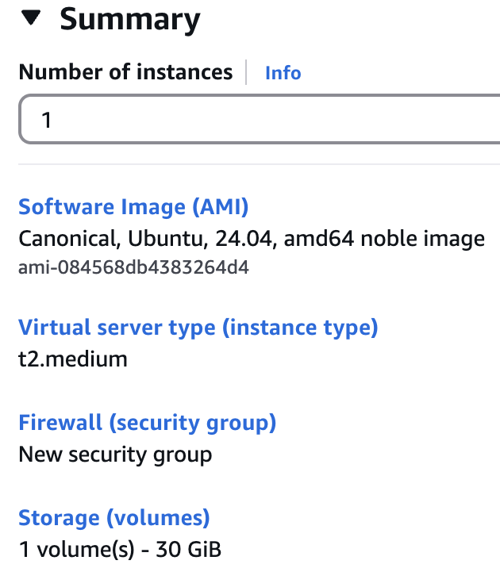

---
**SSH Login Screenshot:**  
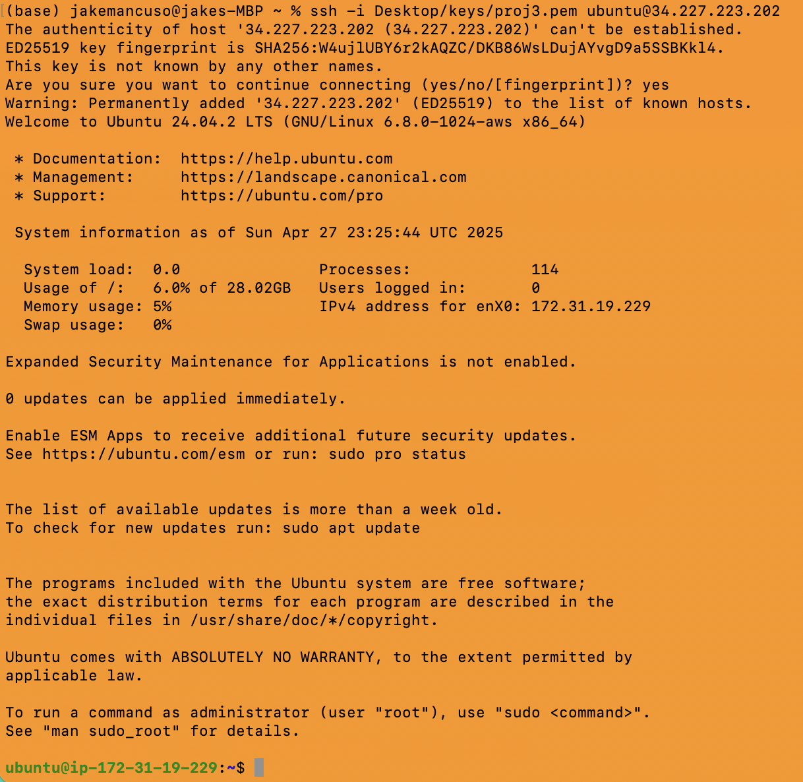 

## **(2.2)** Docker Setup on EC2 Instance 

Installed Docker using the following commands:
- sudo apt update
- sudo apt install -y docker.io
- sudo systemctl start docker
- sudo systemctl enable docker

### Additional Dependencies Based on EC2 Instance OS

Since the EC2 instance was running Ubuntu Server 22.04 LTS (x86),  
the main additional dependency needed for Docker installation was ensuring the system packages were up-to-date.

Commands run:

```bash
- sudo apt update
- sudo apt install -y docker.io
```

Ubuntu 22.04 includes support for systemd, so no further dependencies (such as manual systemd setup) were required.

For running webhook as a service:
- webhook was installed directly using the system package manager (apt).
- No additional manual dependencies like Go runtime or build tools were required, because the apt package for webhook comes precompiled.

Thus, the dependencies were limited to:
- docker.io package
- webhook package
- standard Ubuntu system utilities (already pre-installed on AMI)

### **After installing Docker on the EC2 instance, I confirmed that Docker was correctly installed and functioning by running the following:**

- Verified Docker version:
   ```
   sudo docker --version
  ```
  - Output confirmed Docker was installed and showed the installed version.
   
- Ran a test container:
```
  sudo docker run hello-world
  ```
  - This command downloaded a test image and ran a container that printed a "Hello from Docker!" success message.
  - Confirmed that containers could run properly on the EC2 instance.

**Docker Hello World Screenshot:**  
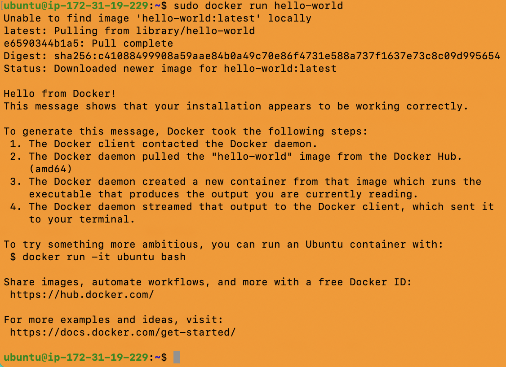

---

## **(2.3)** Pulling the Angular Application Container

Pulled the application image from DockerHub:
- sudo docker pull jakecuso/mancuso-ceg3120:latest

**Pull Screenshot:**  
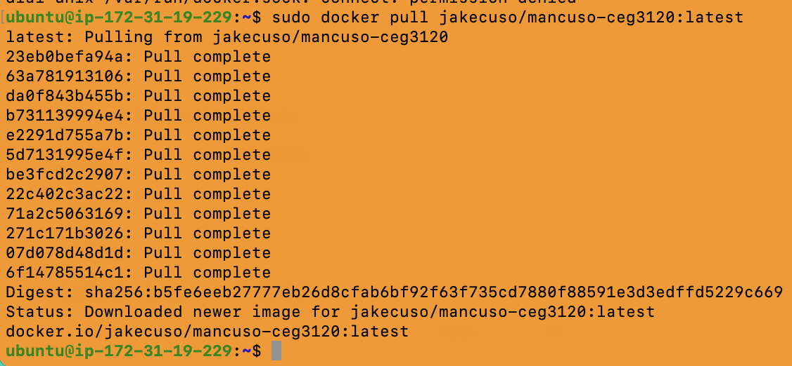

---

## **(2.3)** Running the Application Container

Started the container and mapped port 4200:
- sudo docker run -dit --name angular_app -p 4200:4200 jakecuso/mancuso-ceg3120:latest

**Mapping 4200 Screenshot:**  
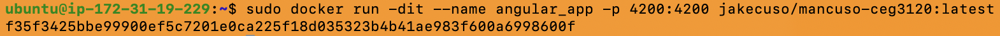  
**Validate Screenshot:**  
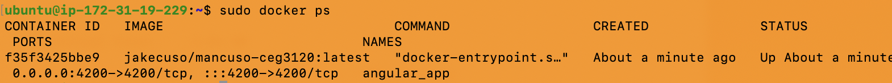

---
## **(2.4)** Crafting the Bash Script for Deployment Refresh

Created a folder called `deployment` to store all deployment-related scripts and configuration.

**Created Deployment Folder Screenshot:**  


---

Created a bash script named `refresh_container.sh` located in the `deployment` folder.

This script does the following:
- Stops the existing container (if it is running)
- Removes the existing container
- Pulls the latest tagged image from DockerHub
- Runs a new container process with the newly pulled image

Commands inside the script:
- sudo docker stop angular_app
- sudo docker rm angular_app
- sudo docker pull jakecuso/mancuso-ceg3120:latest
- sudo docker run -dit --name angular_app -p 4200:4200 jakecuso/mancuso-ceg3120:latest

**Refresh Script Screenshot (Script Content):**  
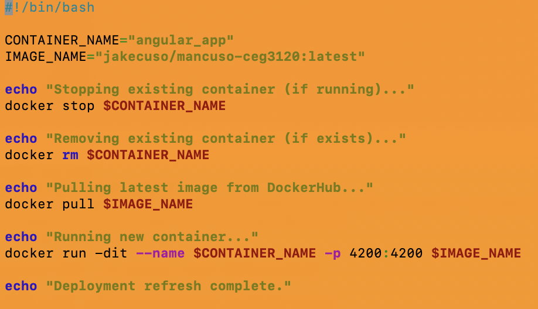

---

Made the script executable using the following command:
- chmod +x refresh_container.sh

**Script Made Executable Screenshot:**  


---

Tested the script manually by running it:
- ./refresh_container.sh

Results:
- Stopped the container (if running)
- Removed the container (if exists)
- Pulled the latest image from DockerHub
- Ran a new container successfully

**Manual Script Run Output Screenshot:**  
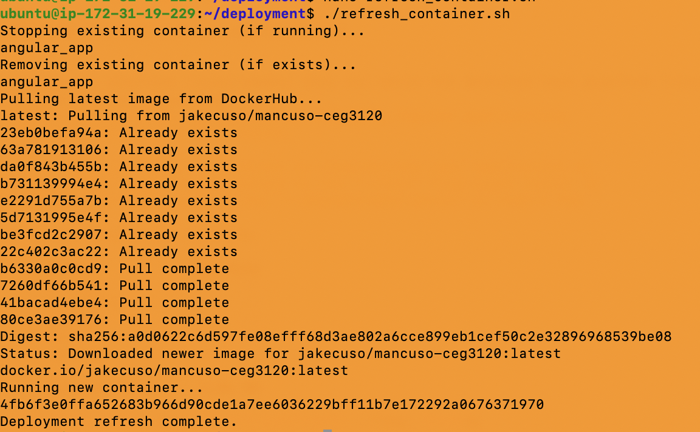

---

## Notes on Permissions

Since my EC2 user did not have direct access to the Docker daemon, I needed to add `sudo` in front of every Docker command inside `refresh_container.sh`.

**Screenshot Showing Script with Sudo Commands:**  
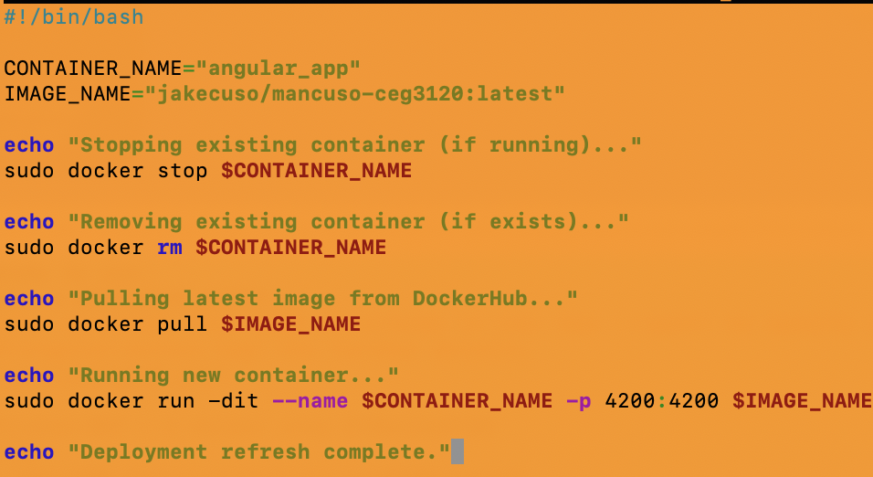

---
## (2.5) Installing and Setting Up Webhook on EC2

Installed the webhook server on the EC2 instance by first updating the package lists and then installing webhook.

After installation, tested that webhook could manually run using the created hook definition.

Created a deployment folder containing the following files:
- refresh_container.sh : A bash script that stops, removes, pulls, and runs the Angular app container.
- hooks.json : A configuration file that defines the rules for when webhook should trigger the refresh script.
- webhook.service : A systemd service file to ensure webhook runs automatically when the EC2 instance starts.

The hook definition:
- Validates that the payload received is from the DockerHub repository jakecuso/mancuso-ceg3120.
- Confirms that the tag pushed is latest.
- If both validations pass, it triggers the refresh_container.sh script to update the running container.

Configured webhook as a system service to automatically start on server reboot.

**Screenshots for 2.5 Setup:**
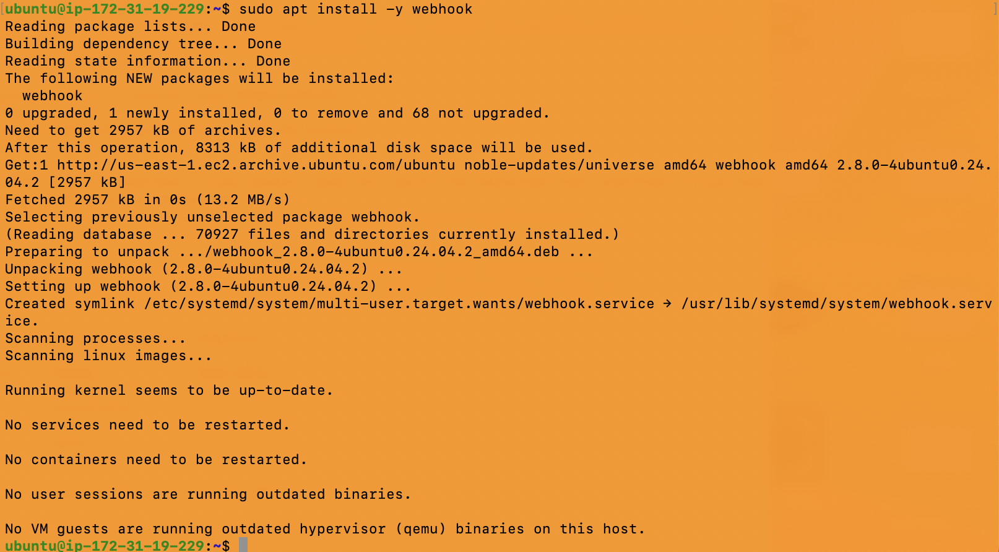

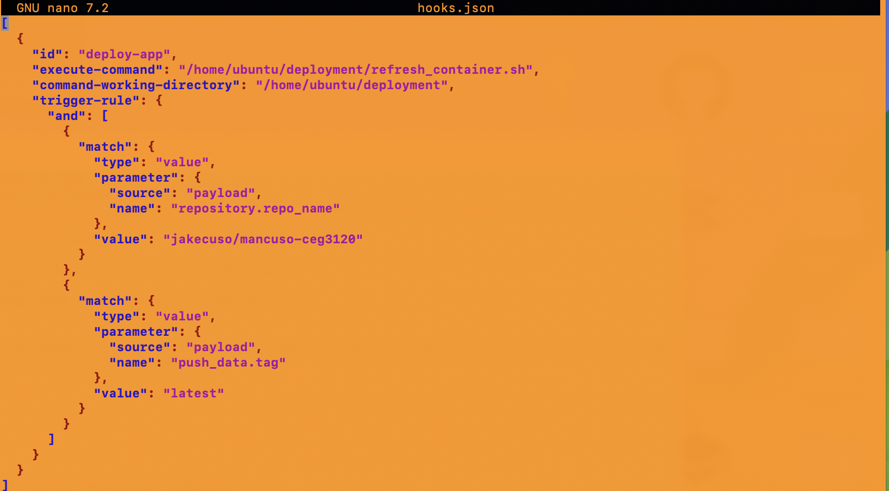

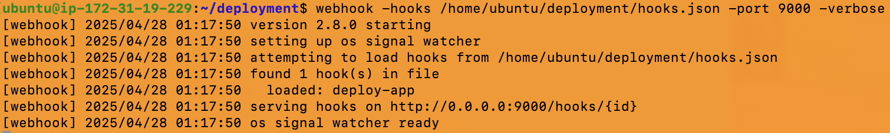

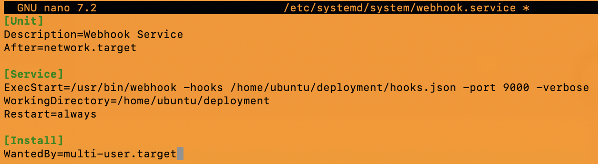

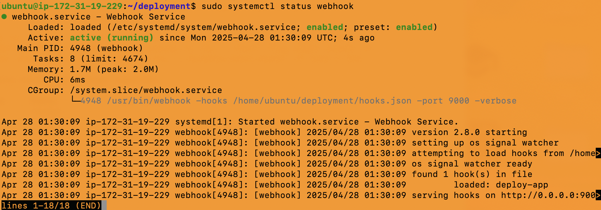

---


## **(2.6) Configuring DockerHub to Send Payloads

**Justification for selecting DockerHub:**
- I chose DockerHub as the payload sender because my deployment depends on automatically pulling updated container images when a new build is pushed.
- DockerHub allows direct webhook triggers when images are updated, making it ideal for seamless container refresh workflows.

**How to enable webhook sending on DockerHub:**
- Logged into DockerHub
- Opened my repository (jakecuso/mancuso-ceg3120)
- Navigated to the **Webhooks** tab
- Created a webhook with the following URL:
  - `http://34.227.223.202:9000/hooks/deploy-app`
- Named the webhook `EC2 Deploy`
- Saved the webhook configuration

**Triggers:**
- The webhook triggers when a new image tagged `latest` is pushed to the DockerHub repository.

**Screenshot of DockerHub Webhook Configuration:**  
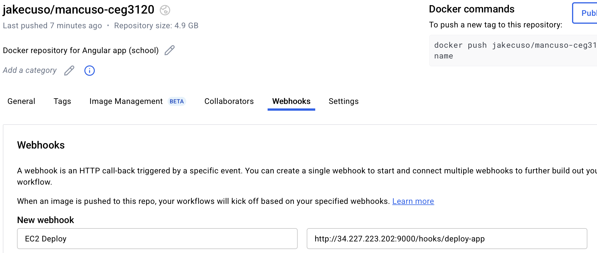

---

## **(2.7) Verifying Payload Delivery and Webhook Triggering

**How to verify a successful payload delivery:**
- Ran `sudo journalctl -u webhook -f` on the EC2 instance to live-monitor webhook logs.
- After pushing a new DockerHub image tagged `latest`, the webhook payload was received.
- Webhook matched the hook ID (`deploy-app`) and triggered `refresh_container.sh`.

**Logs showed:**
- Receipt of a POST request
- Matching of payload trigger rules
- Execution of container refresh steps (stop, remove, pull, run)

**Screenshot of Webhook Receiving and Triggering Script:**  
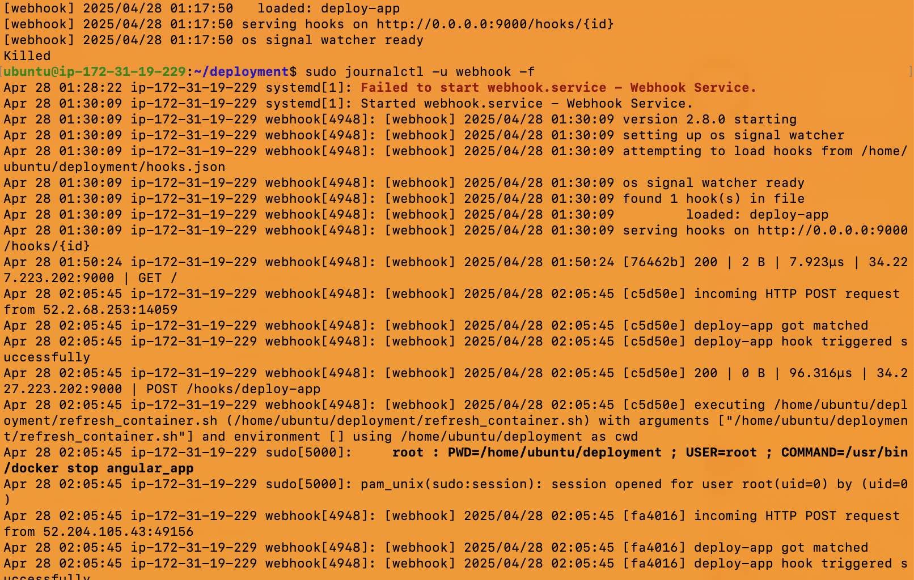

---

## **(2.8) Configuring and Enabling Webhook Service on EC2

**Summary of webhook.service file contents:**
- Service located at `/etc/systemd/system/webhook.service`
- Configured to:
  - Start webhook automatically on EC2 boot
  - Load `/home/ubuntu/deployment/hooks.json`
  - Listen on port 9000
  - Restart on failure

**How to enable and start the webhook service:**
- sudo systemctl daemon-reload
- sudo systemctl enable webhook
- sudo systemctl start webhook

**How to verify webhook service is running:**
- Ran `sudo systemctl status webhook`
- Confirmed service status was **active (running)**.


---

## **(2.9) Final Deployment Folder and Script Links

**Deployment folder contains:**
- `refresh_container.sh` → Bash script that refreshes the container
- `hooks.json` → Webhook definition rules
- `webhook.service` → Service file for auto-start on reboot

**Location in GitHub Repository:**
- `/deployment/refresh_container.sh`
- `/deployment/hooks.json`
- `/deployment/webhook.service`

This satisfies the requirement to include all necessary scripts and configurations for Continuous Deployment.

---

# ✅ Conclusion

This project successfully implemented a Continuous Deployment (CD) pipeline for an Angular application containerized with Docker. By leveraging DockerHub webhooks, the EC2 server is able to automatically pull and redeploy the latest image without manual intervention, ensuring the application stays updated reliably after every DockerHub push. Automation scripts and configuration files are organized and available in the GitHub repository under the `/deployment` folder.