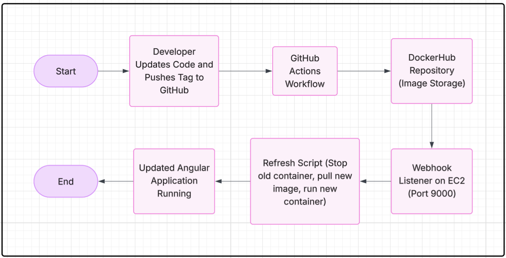
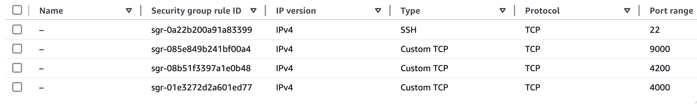
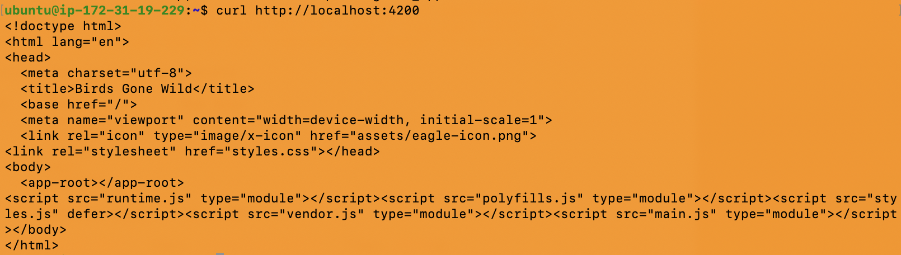
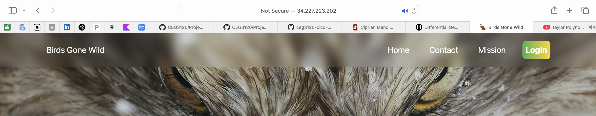
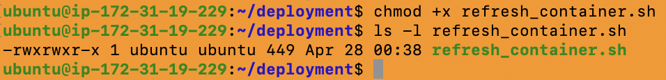

# Continuous Deployment (CD) Workflow 

This document provides the steps for **generating tags**, **viewing tags**, and **pushing tags** in my Git repository. Tags are essential for versioning and triggering your CI/CD pipelines.

# Continuous Deployment Project Overview

## Project Goal
The goal of this project is to implement a full Continuous Deployment (CD) pipeline for an Angular application using Docker, DockerHub, GitHub Actions, and an AWS EC2 instance.  
Changes pushed to GitHub and DockerHub automatically trigger an update to the live running application on the EC2 server without manual intervention.

## Tools and Roles
- **Docker**: Containerizes the Angular application.
- **DockerHub**: Stores and distributes the built container images.
- **GitHub Actions**: Automates building and pushing container images to DockerHub when new tags are pushed.
- **AWS EC2 Instance**: Hosts the running container serving the Angular application.
- **adnanh's Webhook**: Listens for payloads and triggers the container refresh automatically on the EC2 instance.
- **Systemd (Linux)**: Manages the webhook as a service so that it starts on boot and stays alive.

## Project Diagram


---

## Known Issues (If Any)
All parts of the project function correctly at the time of submission. No known issues at this time.


---

## 1) **Generating Tags**

In Git, tags are used to mark specific points in the project’s history. They are commonly used to mark release versions.

To **generate a tag** in Git, use the following command:

```bash
git tag -a <tag_name> -m "<message>"
```
<t-ag_name->: The name of the tag, typically following semantic versioning, e.g., v1.0.0.

<-message->: A short description of the tag (similar to a commit message).

Example:
```bash
git tag -a v1.0.0 -m "First release for Project 5"
```
This will create an annotated tag with the name v1.0.0 and a message "First release for Project 5".

## 2) How to See Tags in a Git Repository?

To see all the tags in your Git repository, I'd use the following command:
```bash
git tag
```
This will list all the tags available in the current repository. For more detailed information about each tag, you can use:
```bash
git show <tag_name>
```
Example:
```bash
git show v1.0.0
```
## 3) How To Generate a Tag in a Git Repository?

To create a new tag in the repository:

Navigate to my repository on my local machine. I 
Ran the following command to create a new tag:
```bash
git tag -a v1.0.1 -m "Tag for version 1.0.1"
```
`Verify the tag was created`:
git tag
This should display `v1.0.1` as part of the list of tags.
## 4) How to Push a Tag in a Git Repository to GitHub

Once you have created a tag locally, you need to push it to GitHub to trigger the CI/CD workflow.

To push a single tag:
```bash
git push origin <tag_name>
```
Example:
```bash
git push origin v1.0.1
```
If I want to push all tags at once:
```
git push --tags
```
This will push all tags that are available in my local repository to GitHub.

---


# Semantic Versioning Container Images with GitHub Actions

This document will explain how the **GitHub Actions workflow** for **semantic versioning** of container images works. The workflow is responsible for automating the process of building, tagging, and pushing Docker images to **DockerHub** when new version tags are pushed to the repository.

---

## Summary of What a Workflow Does and When It Does It

The **workflow** is designed to build and push **Docker images** to **DockerHub** whenever a **version tag** is pushed to the GitHub repository. It uses **semantic versioning** (e.g., `v1.0.0`, `v1.1.0`) to tag the Docker images. The workflow only runs when a tag is pushed to GitHub that follows the pattern `v*.*.*`.

### Trigger:
- The workflow is triggered by **pushes to tags** matching the format `v*.*.*` (e.g., `v1.0.0`, `v2.1.0`).
- The **push** can either come from the `main` branch or from a version tag.

---

## Explanation of Workflow Steps

1. **Checkout the Code**:
   - The workflow checks out the code from the repository using the `actions/checkout@v2` action to ensure the code and Dockerfile are available to the runner.
   ```yaml
   - name: Checkout code
     uses: actions/checkout@v2
    ```
    

2. **Set Up Docker Buildx**:
   - The `docker/setup-buildx-action@v1` action is used to set up **Docker Buildx**, which provides advanced features for building Docker images, including multi-platform support.
   ```yaml
   - name: Set up Docker Buildx
     uses: docker/setup-buildx-action@v1
    ```
3. **Login to DockerHub**:
   - The workflow logs into **DockerHub** using the `docker/login-action@v1` action. It uses the **DockerHub credentials** stored in **GitHub Secrets** (`DOCKER_USERNAME` and `DOCKER_TOKEN`).
   ```yaml
   - name: Login to DockerHub
     uses: docker/login-action@v1
     with:
       username: ${{ secrets.DOCKER_USERNAME }}
       password: ${{ secrets.DOCKER_TOKEN }}
    ```
4. **Build and Push the Docker Image**:
   - The `docker/build-push-action@v2` action is used to build the Docker image from the repository's Dockerfile and push the built image to **DockerHub**. 
   - The image is tagged using **semantic versioning** based on the GitHub tag (e.g., `v1.0.0`, `v1.1.0`).
   ```yaml
   - name: Build and push Docker image
     id: docker_build
     uses: docker/build-push-action@v2
     with:
       context: ./project5  # Build the Docker image from project5 folder
       push: true  # Push the image to DockerHub
       tags: |
         ${{ secrets.DOCKER_USERNAME }}/${{ secrets.DOCKER_HUB_REPO }}:latest
         ${{ secrets.DOCKER_USERNAME }}/${{ secrets.DOCKER_HUB_REPO }}:${{ github.sha }}
         ${{ secrets.DOCKER_USERNAME }}/${{ secrets.DOCKER_HUB_REPO }}:${{ github.ref_name }}
    ```

---

## Explanation / Highlight of Values That Need Updated If Used in a Different Repository

If I was to use this workflow in a **different repository**, the following values need to be updated:

1. **DOCKER_USERNAME**:
   - The DockerHub username must be updated in **GitHub Secrets**. This username will be used for both the login and the tag naming.
   - Example: `your-docker-username`.

2. **DOCKER_HUB_REPO**:
   - The **DockerHub repository** name needs to be updated. This should be the name of the repository in DockerHub where the image will be pushed.
   - Example: `your-repository-name`.

3. **GitHub Secrets**:
   - Update **DOCKER_USERNAME**, **DOCKER_TOKEN**, and **DOCKER_HUB_REPO** in the repository's **GitHub Secrets**.
   - Make sure that the **DockerHub token** has both **read and write** permissions.

4. **Build Context**:
   - If the Dockerfile or the project folder is in a different location, change the `context` value. For example, if I want to build from `project4`, update the context to `./project4`. 
   
   *In my case I have it in both (project 4 & 5 to show my progress) but my most updated workflow is in project 5 so im using that*

---


## Link to Workflow File in my GitHub Repository


[ci-project5.yml Workflow File](https://github.com/WSU-kduncan/ceg3120-cicd-Jakecuso/tree/main/.github/workflows)


---


# Testing & Validating

This section describes how to test and validate that my GitHub Actions workflow for **building and pushing Docker images** works as expected, and how to verify that the image in **DockerHub** works when run in a container.

---

## How I Can Test That My Workflow Did Its Tasking

1. **Verify Workflow Run**:
   - Go to the **GitHub repository** and navigate to the **Actions** tab.
   - Check if the workflow ran successfully when a tag was pushed to the repository.
   - Ensure the workflow completes without errors in the logs. If there are errors, check the logs to identify what went wrong.

2. **Check DockerHub**:
   - Log in to **DockerHub**.
   - Go to the repository where the image was pushed.
   - Verify that the **Docker image** appears in the repository with the appropriate tags (e.g., `latest`, version tag like `v1.0.0`, or commit SHA).

3. **Check Build Logs**:
   - In the **GitHub Actions** tab, review the logs for the **Build and Push Docker image** step. Ensure that the build was successful and that the image was pushed to DockerHub.

---

## How to Verify That the Image in DockerHub Works When a Container Is Run Using the Image (Steps & Instrutions)

Once the Docker image has been pushed to DockerHub, it's important to verify that it works as expected by running a container.

1. **Pull the Image from DockerHub**:
   - On your local machine or in a remote environment, pull the image from DockerHub to ensure it was successfully pushed.
   Example:
   ```bash
     docker pull jakecuso/mancuso-ceg3120:v1.0.0
    ```
2. **Run the Docker Container**:
   - Run the container using the pulled image. You can start a container in interactive mode to test it.
   Example:
   ```bash
     docker run -it jakecuso/mancuso-ceg3120:v1.0.0 bash
    ```
3. **Verify the Container's Functionality**:
   - Once inside the container, check if the application or service that is being containerized is running correctly.
   - You can run commands specific to your application to verify its functionality, such as checking a web service or verifying a running process inside the container.

4. **Check Container Logs**:
   - If the container doesn't behave as expected, view the logs to diagnose the issue.
   Example:
   ```bash
     docker logs <container_id>
    ```
5. **Test the Application**:
   - If your image contains a web application, try to access it through the exposed ports. For example, if the application is supposed to be available on port `80`, you can map the port like this:
   ```bash
     docker run -p 8080:80 jakecuso/mancuso-ceg3120:v1.0.0
    ```
   Then access it through `http://localhost:8080` to verify the application is running as expected.

---

## Part 1 Conclusion

By following these steps, I can **test the workflow** that builds and pushes the Docker image and **validate the functionality** of the image by running it as a container. This ensures that my **CI/CD pipeline** works correctly and that the image I deploy in DockerHub works as intended when run in any environment.

This document explains how my **CI/CD workflow** handles **semantic versioning** for Docker images and automates the process of building and pushing them to DockerHub. The workflow will be triggered by a tag push and will apply the appropriate version tags to my Docker image, ensuring a smooth **continuous deployment** process.

Tags are an essential part of version control in Git and are used extensively in **Continuous Deployment (CD)** workflows. By generating, viewing, and pushing tags, I can trigger automated processes and keep track of versions in my project. 
---

# Part 2 Continuous Deployment (CD)

## Tasks

- **(2.1)** Note your EC2 instance details

- **(2.2)** Install Docker to your EC2 instance

 - **(2.3)** Test that your EC2 instance can run a container from your DockerHub repository image
 - **(2.4)** Craft a bash script that will:
   - stop and remove the formerly running container
   - pull the latest tagged image from your DockerHub repository
   - run a new container process with the pull'ed image
   - ADD bash script to folder named deployment in your GitHub repository
- **(2.5)** Install adnanh's webhook to your EC2 instance
- **(2.6)** Create a configuration file - a hook definition - for webhook to load when ran. The hook definition should:
   - Trigger your bash script to run when a payload is received
    - Validate that the payload came from a trusted source via a shared secret or by validating payload is from DockerHub or GitHub
   - ADD hook definition to folder named deployment in your GitHub repository
- **(2.7)** Configure DockerHub or GitHub to send a Webhook payload to your EC2 instance when an appropriate event occurs
 -  **(2.8)** Set up a service file such that the webhook is set to start listening as soon as the EC2 instance is on. Enable this service and verify it triggers your bash script to run when a message is received
-  **(2.9)** ADD webhook service file to folder named deployment in your GitHub repository

## **(2.1)** EC2 Instance Details

- **AMI**: Ubuntu Server 22.04 LTS (x86)
- **Instance Type**: `t2.medium`
- **Storage**: 30 GB
- **Key Pair**: `proj3.pem` (used the same KP from p3 bc lazy!)
- **Security Group Rules**:
  - SSH (TCP 22) - Allowed from My IP
  - App (TCP 4200) - Allowed from Anywhere (`0.0.0.0/0`)
  - Webhook (TCP 9000) - Allowed from Anywhere (`0.0.0.0/0`)
  - Reserved (TCP 4000) - Future use (mistake lol)
  

**Screenshot of AWS Instance Details :**  


---
**SSH Login Screenshot:**  
 

## **(2.2)** Docker Setup on EC2 Instance 

Installed Docker using the following commands:
- sudo apt update
- sudo apt install -y docker.io
- sudo systemctl start docker
- sudo systemctl enable docker

### Additional Dependencies Based on EC2 Instance OS

Since the EC2 instance was running Ubuntu Server 22.04 LTS (x86),  
the main additional dependency needed for Docker installation was ensuring the system packages were up-to-date.

Commands run:

```bash
- sudo apt update
- sudo apt install -y docker.io
```

Ubuntu 22.04 includes support for systemd, so no further dependencies (such as manual systemd setup) were required.

For running webhook as a service:
- webhook was installed directly using the system package manager (apt).
- No additional manual dependencies like Go runtime or build tools were required, because the apt package for webhook comes precompiled.

Thus, the dependencies were limited to:
- docker.io package
- webhook package
- standard Ubuntu system utilities (already pre-installed on AMI)

### **After installing Docker on the EC2 instance, I confirmed that Docker was correctly installed and functioning by running the following:**

- Verified Docker version:
   ```
   sudo docker --version
  ```
  - Output confirmed Docker was installed and showed the installed version.
   
- Ran a test container:
```
  sudo docker run hello-world
  ```
  - This command downloaded a test image and ran a container that printed a "Hello from Docker!" success message.
  - Confirmed that containers could run properly on the EC2 instance.

**Docker Hello World Screenshot:**  


---

## **(2.3)** Pulling the Angular Application Container

### How to Pull a Container Image from DockerHub Repository

To pull a container image from my DockerHub repository to the EC2 instance, I ran the following command:
```
- sudo docker pull jakecuso/mancuso-ceg3120:latest
```
This command:
- Contacts DockerHub servers
- Downloads the image tagged as `latest` from the `jakecuso/mancuso-ceg3120` repository
- Stores the image locally on the EC2 instance for use in creating containers

After pulling, the image could be seen by running:
```
sudo docker images
```
This confirmed the image was successfully pulled and ready for deployment.

Pulled the application image from DockerHub using: 
```
sudo docker pull jakecuso/mancuso-ceg3120:latest
```
**Pull Screenshot:**  


After pulling the image from DockerHub, I ran a container using the following command:
```
sudo docker run -dit --name angular_app -p 4200:4200 jakecuso/mancuso-ceg3120:latest
```
Explanation of the command:
- `docker run` starts a new container.
- `-d` flag runs the container **detached** (in the background).
- `-i` flag keeps STDIN open so the container can interact if needed.
- `-t` flag allocates a pseudo-TTY terminal for the container.

The `-p 4200:4200` part maps port 4200 inside the container to port 4200 on the EC2 server, making the Angular app accessible externally.

---

### Differences Between `-it` and `-d` Flags and Recommendation

- **`-it` Flags**:
  - Interactive mode.
  - Useful when you want to attach to a container and work inside it (ex: bash into the container).
  - Keeps terminal open for user input.

- **`-d` Flag**:
  - Detached mode.
  - Runs the container in the background.
  - Good for production applications where you don't need to manually interact with the container.

**Recommendation After Testing:**
- For deployment after testing, I recommend **using the `-d` flag** so that the Angular application container runs continuously in the background without requiring an active SSH session.
---


### How to Verify that the Container is Successfully Serving the Angular Application

**Validation from the Container Side:**
- Accessed the container interactively by running:
```
  sudo docker exec -it angular_app bash
  ```
- Inside the container, ran:
```
   curl http://localhost:4200
  ```
  
- Received an HTML response, confirming that the Angular application server was running internally inside the container.

---

**Validation from the Host (EC2) Side:**
- From the EC2 instance (not inside the container), ran:
```
   curl http://localhost:4200
  ```
- Also received the expected HTML content.

**Curl EC2 Screenshot:**  

- Confirmed that port mapping (`-p 4200:4200`) was successful and the app was accessible from the EC2 host machine.

---

**Validation from an External Connection (Physical System):**
- Opened a web browser on my laptop.
- Navigated to:
  - http://34.227.223.202:4200
- Successfully loaded the Angular application page.
- Confirmed that the EC2 firewall (Security Group) allowed inbound traffic on TCP port 4200.

**Screenshot of External Validation (Browser Loading App):**  


also these are good commands to use 


### Steps to Manually Refresh the Container Application if a New Image is Available on DockerHub

If a new version of the container image is pushed to DockerHub, the container running on the EC2 instance can be manually refreshed with the following steps:

1. **Stop the Currently Running Container**
   - sudo docker stop angular_app

2. **Remove the Stopped Container**
   - sudo docker rm angular_app

3. **Pull the Latest Image from DockerHub**
   - sudo docker pull jakecuso/mancuso-ceg3120:latest

4. **Run a New Container Using the Latest Image**
   - sudo docker run -dit --name angular_app -p 4200:4200 jakecuso/mancuso-ceg3120:latest

---

These steps manually:
- Stop the old version of the application,
- Remove the old container instance,
- Pull the updated image from DockerHub,
- Start a fresh container serving the newest application version.

This manual process is automated through the `refresh_container.sh` script during webhook-triggered automatic deployment.

---
## **(2.4)** Crafting the Bash Script for Deployment Refresh

Created a folder called `deployment` to store all deployment-related scripts and configuration.

**Created Deployment Folder Screenshot:**  


---

Created a bash script named `refresh_container.sh` located in the `deployment` folder.

Made the script executable using the following command:
- chmod +x refresh_container.sh

**Script Made Executable Screenshot:**  



This script does the following:
- Stops the existing container (if it is running)
- Removes the existing container
- Pulls the latest tagged image from DockerHub
- Runs a new container process with the newly pulled image

Commands inside the script:
```
sudo docker stop angular_app
```
```
sudo docker rm angular_app
```
```
sudo docker pull jakecuso/mancuso-ceg3120:latest
```
```
sudo docker run -dit --name angular_app -p 4200:4200 jakecuso/mancuso-ceg3120:latest
```
**Refresh Script Screenshot (Script Content):**  


### How to Test that the Script Successfully Performs Its Taskings

Tested the script manually by running it:
- ./refresh_container.sh

Results:
- Stopped the container (if running)
- Removed the container (if exists)
- Pulled the latest image from DockerHub
- Ran a new container successfully

**Manual Script Run Output Screenshot:**  


---

## Notes on Permissions

Since my EC2 user did not have direct access to the Docker daemon, I needed to add `sudo` in front of every Docker command inside `refresh_container.sh`.

**Screenshot Showing Script with Sudo Commands:**  


After creating the `refresh_container.sh` script, I tested its functionality by manually executing the script on the EC2 instance:

- ./refresh_container.sh


**Verification steps included:**
- Running `sudo docker ps` to confirm the container was running.

- Running `curl localhost:4200` from the EC2 instance to confirm the application was being served.

- Accessing the application from my laptop via `http://<EC2-Public-IP>:4200`.

Each step worked without manual intervention, confirming the script automated the refresh task properly.


### Link to Bash Script in Repository

The `refresh_container.sh` script is located in the `/deployment` folder of my GitHub repository:

- [refresh_container.sh](https://github.com/WSU-kduncan/ceg3120-cicd-Jakecuso/blob/main/project5/deployment/refresh_container.sh)

 
---

## (2.5) Installing and Setting Up Webhook on EC2
### How to Install Adnanh's Webhook to the EC2 Instance
https://github.com/adnanh/webhook

To install the webhook server on my EC2 instance running Ubuntu 22.04 LTS, I followed these steps:

1. **Update the System Package Index**
   - sudo apt update

2. **Install Webhook Using Apt Package Manager**
   - sudo apt install -y webhook


This installed the official webhook package from the Ubuntu repositories.  

No additional compilation or manual installation steps were required because Ubuntu 22.04 provides a prebuilt webhook binary through apt.


**Screenshot of Webhook Installation and Manual Run:**  

---
### How to Verify Successful Installation of Webhook & How to Verify that the Definition File (hooks.json) Was Loaded by Webhook


After installing webhook using the apt package manager, I verified that the installation was successful by completing the following steps:

1. **Checked the Webhook Version**
   - Ran the command:
   ```
      webhook --version
     ```
   - Output displayed the installed webhook version (v2.8.0), confirming it was correctly installed on the system.

2. **Manually Started Webhook with a Sample Hook File**
   - Created a basic `hooks.json` file in the `/home/ubuntu/deployment/` folder.

   - Started webhook manually by running:
   ```
      webhook -hooks /home/ubuntu/deployment/hooks.json -port 9000 -verbrose
     ```


   - Webhook output indicated it was:
     - Loading the hooks file successfully.
     - Listening for incoming HTTP requests on port 9000.

3. **Monitored the Webhook Logs**
   - Used:
     - sudo journalctl -u webhook -f
   - Verified that no errors occurred and that webhook responded when accessed externally or when payloads were sent.

---
### Summary of the Webhook Definition File (hooks.json)

The `hooks.json` file defines how webhook should respond when it receives an HTTP payload.  
It contains the following important fields:

- **id**: `"deploy-app"`  
  - Unique identifier for the hook.
  - Webhook listens at the endpoint `/hooks/deploy-app`.

- **execute-command**: `"/home/ubuntu/deployment/refresh_container.sh"`  
  - Specifies the bash script that webhook should run when the trigger conditions are met.

- **command-working-directory**: `"/home/ubuntu/deployment"`  
  - Sets the working directory for when the command is executed.

- **trigger-rule**:  
  - Contains rules that must match the incoming payload for the hook to execute.
  - Specifically:
    - Verifies that the `repository.repo_name` field in the payload matches `jakecuso/mancuso-ceg3120`.
    - Verifies that the `push_data.tag` field is `latest`.

If both trigger conditions are true, webhook will automatically run the `refresh_container.sh` script to pull the new image and restart the container.


**Screenshot Showing Hooks.json Definition:**  


---


### How to Verify Webhook is Receiving Payloads That Trigger It

After setting up the webhook listener and linking DockerHub, I verified webhook was receiving and responding to payloads by:

1. **Live Monitoring Webhook Logs**
   - Ran:
     - sudo journalctl -u webhook -f
   - This command streamed live log output from the webhook systemd service.

2. **Triggering a Payload Event**
   - Pushed an updated Docker image tagged `latest` to my DockerHub repository (jakecuso/mancuso-ceg3120).

3. **Observing Webhook Behavior in Logs**
   - Upon pushing the update, the webhook logs showed:
     - Receipt of an HTTP `POST` request to `/hooks/deploy-app`
     - Matching of trigger conditions defined in `hooks.json`
     - Execution of the `refresh_container.sh` script
   - Key messages in logs:
     - `[webhook] 200 | matched hook: deploy-app`
     - `[webhook] executing command /home/ubuntu/deployment/refresh_container.sh`

This confirmed that:
- The webhook listener was properly active on port 9000.
- Payloads from DockerHub were successfully reaching the EC2 instance and triggering actions.

---

### How to Monitor Logs from the Running Webhook

To continuously monitor the webhook and catch real-time incoming payloads:

- Ran:
  - sudo journalctl -u webhook -f

This displayed:
- Incoming connections
- Successful hook matches
- Triggered executions of the refresh script
- Any error messages if payloads were invalid

Monitoring these logs was crucial during testing to ensure the system was functioning automatically after each DockerHub push.

---

### What to Look for in Docker Process Views

After webhook triggered the container refresh, I validated the correct container behavior using Docker commands:

- Listed running containers with:
  - sudo docker ps

What to look for:
- A running container named `angular_app`
- The correct image `jakecuso/mancuso-ceg3120:latest`
- Ports mapping `0.0.0.0:4200->4200/tcp`
- Up-time showing that a **new container** had been recently created (timestamp resets)

This confirmed that:
- The old container was successfully stopped and removed
- A new container was pulled and started automatically
- The updated application was now serving on port 4200


### Link to Definition File in Repository

The `hooks.json` webhook definition file is located inside the `/deployment` folder in my GitHub repository:

- [hooks.json](https://github.com/WSU-kduncan/ceg3120-cicd-Jakecuso/blob/main/project5/deployment/hooks.json)
This file defines the trigger rules and specifies the command (`refresh_container.sh`) that should execute when a valid webhook payload is received from DockerHub.

**Screenshots for 2.5 Setup:**


---


## **(2.6) Configuring DockerHub to Send Payloads

## (2.6) Configuring DockerHub to Send Payloads

**Justification for Selecting DockerHub as Payload Sender:**
- I chose DockerHub because it can automatically send webhook payloads when a new container image is pushed, allowing seamless deployment updates.

**How to Enable Payload Sending:**
- Logged into DockerHub, opened my repository (`jakecuso/mancuso-ceg3120`), navigated to the **Webhooks** tab.
- Created a webhook with URL:
  - `http://34.227.223.202:9000/hooks/deploy-app`
- Named the webhook `EC2 Deploy` and saved.

**Screenshot of DockerHub Webhook Configuration:**  


---

### What Triggers Send a Payload to the EC2 Webhook Listener

- A webhook payload is triggered when a Docker image tagged as `latest` is pushed to the `jakecuso/mancuso-ceg3120` repository.
- DockerHub sends a POST request to `http://34.227.223.202:9000/hooks/deploy-app`.
- Webhook matches the repository name and tag in `hooks.json` and triggers the `refresh_container.sh` script to refresh the running container.

---

### How to Verify a Successful Payload Delivery

1. **Monitor Webhook Logs**
   - Used `sudo journalctl -u webhook -f` to watch for incoming POST payloads.

2. **Push an Updated Image**
   - Built and pushed an updated `latest` Docker image to DockerHub.

3. **Check Webhook Logs**
   - Verified logs showed:
     - `[webhook] matched hook: deploy-app`
     - `[webhook] executing command /home/ubuntu/deployment/refresh_container.sh`

4. **Check Docker Containers**
   - Confirmed a new container instance was running (`sudo docker ps`).

5. **Access Application Externally**
   - Opened `http://34.227.223.202:4200` in a web browser and verified the application loaded.

**Screenshot of Webhook Receiving Payload and Triggering Script:**  

---

##  **(2.7)** Verifying Payload Delivery and Webhook Triggering

**Summary of webhook.service file contents:**
- Service file located at `/etc/systemd/system/webhook.service`
- Configured to:
  - Start webhook automatically when the EC2 instance boots
  - Load the hooks.json file from `/home/ubuntu/deployment/`
  - Listen for HTTP POST requests on port 9000
  - Restart automatically if it fails

---

**How to enable and start the webhook service:**
- sudo systemctl daemon-reload
- sudo systemctl enable webhook
- sudo systemctl start webhook

---

**How to verify webhook service is capturing payloads and triggering bash script:**
- Ran `sudo journalctl -u webhook -f` to monitor logs live
- Pushed a new Docker image to DockerHub tagged `latest`
- Observed webhook logs showing:
  - Receipt of POST payload
  - Matching hook `deploy-app`
  - Execution of `/home/ubuntu/deployment/refresh_container.sh`
- Ran `sudo docker ps` to verify a refreshed container was running
- Accessed `http://34.227.223.202:4200` externally to verify the updated app

---

**Link to webhook.service file in repository:**
- [webhook.service ](https://github.com/WSU-kduncan/ceg3120-cicd-Jakecuso/blob/main/project5/deployment/webhook.service)

# ✅ Conclusion

This project successfully implemented a Continuous Deployment (CD) pipeline for an Angular application containerized with Docker. By leveraging DockerHub webhooks, the EC2 server is able to automatically pull and redeploy the latest image without manual intervention, ensuring the application stays updated reliably after every DockerHub push. Automation scripts and configuration files are organized and available in the GitHub repository under the `/deployment` folder.

---
## **Resources**
###### For additional information, guides, and references related to Docker, GitHub Actions, Angular, and more, check out the [Resources](README-RESOURCES.md). That I used to make this Project :)
